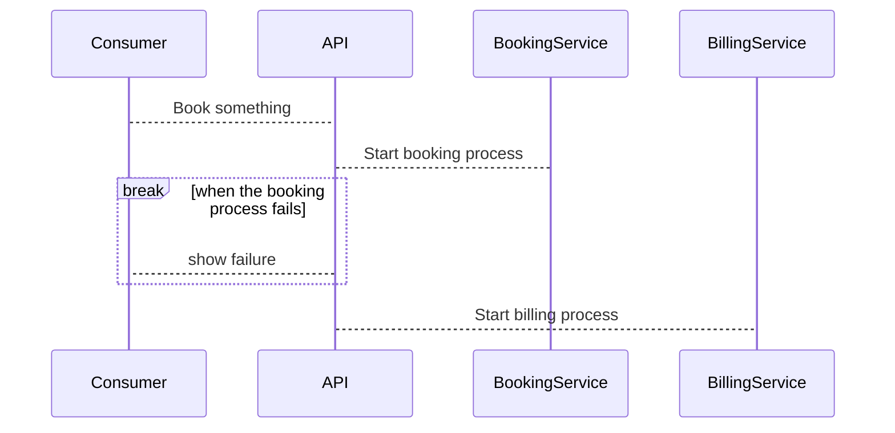
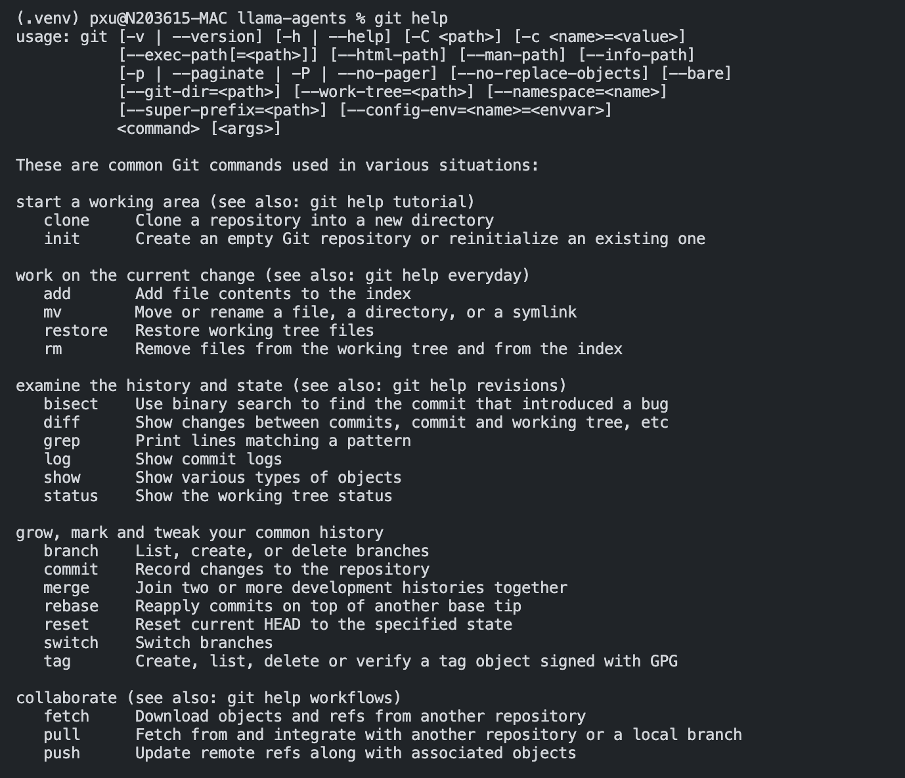

# Table of Content

<!-- @import "[TOC]" {cmd="toc" depthFrom=1 depthTo=6 orderedList=false} -->

<!-- code_chunk_output -->

- [Table of Content](#table-of-content)
  - [Check llamaAgents Version](#check-llamaagents-version)
  - [Daily](#daily)
    - [07/05](#0705)
    - [07/04:](#0704)
      - [installed starship Prompt configurator](#installed-starship-prompt-configurator)
      - [CHAT Participant in Github CoPilot Chat](#chat-participant-in-github-copilot-chat)
      - [corrective_rag.ipynb](#corrective_ragipynb)
      - [07/04: MPE & PlantUML, Mermaid](#0704-mpe--plantuml-mermaid)
      - [mermaid](#mermaid)
      - [PlantUML](#plantuml)
    - [07/03: Test docker-kube example](#0703-test-docker-kube-example)
  - [Utils](#utils)
    - [GIT](#git)
      - [common](#common)
      - [rebase](#rebase)
    - [load_dotenv](#load_dotenv)
    - [TIPs](#tips)

<!-- /code_chunk_output -->


## Check llamaAgents Version

1. open a new terminal
2. check versions

```bash
cd /Users/pxu/CODE/GenAI4Code/llama-agents
poetry shell
which pip 
pip list | grep llama-agents
```

3. install/update as needed (check pyproject.toml)

```bash
poetry install
```

4. check nodejs execution

```javascript {cmd="node"}
const date = Date.now()
console.log(date.toString())
```

## Daily

### 07/05

- created First PR
- Debug the BUG: RouterComponent (potentially another PR)


### 07/04:  

#### installed starship Prompt configurator
- [install starship](https://starship.rs/guide/)
- [install nerd font](https://docs.rockylinux.org/books/nvchad/nerd_fonts/)
  - directory installed:  	/Users/pxu/Library/Fonts/NerdFonts
  - https://support.apple.com/guide/font-book/install-and-validate-fonts-fntbk1000/mac

- [configure terminal to use](https://webinstall.dev/nerdfont/)


#### CHAT Participant in Github CoPilot Chat
- [@cat sample source code](https://github.com/microsoft/vscode-extension-samples/tree/main/chat-sample)
- [VSCode June New](https://code.visualstudio.com/updates/v1_91#_chat-and-language-model-api)
- [BLOG](https://code.visualstudio.com/blogs/2024/06/24/extensions-are-all-you-need)

#### corrective_rag.ipynb

Tested CRAG which was released on the same day
[CRAG commit](https://github.com/run-llama/llama-agents/commit/63ca4d0be8012f442b1772dce2e634731d157d10)

#### 07/04: MPE & PlantUML, Mermaid

1. [Vscode markdown](https://code.visualstudio.com/docs/languages/markdown#:~:text=Inserting%20images%20and%20links%20to%20files&text=You%20can%20Drag%20and%20drop,dropping%20it%20into%20the%20file.)
2. [MPE docs](https://shd101wyy.github.io/markdown-preview-enhanced/#/diagrams?id=plantuml)
3. [Mermaid docs](https://mermaid.js.org/syntax/sequenceDiagram.html)
4. [PlantUML docs](https://plantuml.com/sequence-diagram)

#### mermaid



/// with background

```mermaid
sequenceDiagram
    participant Alice
    participant John

    rect rgb(191, 223, 255)
    note right of Alice: Alice calls John.
    Alice->>+John: Hello John, how are you?
    rect rgb(200, 150, 255)
    Alice->>+John: John, can you hear me?
    John-->>-Alice: Hi Alice, I can hear you!
    end
    John-->>-Alice: I feel great!
    end
    Alice ->>+ John: Did you want to go to the game tonight?
    John -->>- Alice: Yeah! See you there.
 ```   


#### PlantUML

```puml
@startuml
participant Participant as Foo
actor       Actor       as Foo1
boundary    Boundary    as Foo2
control     Control     as Foo3
entity      Entity      as Foo4
database    Database    as Foo5
collections Collections as Foo6
queue       Queue       as Foo7
Foo -> Foo1 : To actor 
Foo -> Foo2 : To boundary
Foo -> Foo3 : To control
Foo -> Foo4 : To entity
Foo -> Foo5 : To database
Foo -> Foo6 : To collections
Foo -> Foo7: To queue
@enduml

```


### 07/03: Test docker-kube example

////set environment variables

```bash
cd /Users/pxu/CODE/GenAI4Code/llama-agents/zPX/examples/docker-kubernetes
set -a && source multi-agent-app/.env.local
```

////activate the project virtual env

```bash
cd multi-agent-app/ && poetry shell && poetry install && cd ../
```

/// launch server

```bash
python multi-agent-app/multi_agent_app/local_launcher.py
```

/// launch client In another terminal

```bash
pwd
cd /Users/pxu/CODE/GenAI4Code/llama-agents/zPX/examples
pwd
ls
source ../../.venv/bin/activate
python TESTclient.py
```

/// OR use the built-in client

```bash
llama-agents monitor --control-plane-url http://127.0.0.1:8001
```

//// use Kubectl

```bash
kubectl config get-contexts
kubectl config use-context docker-desktop
kubectl get nodes
kubectl -n llama-agents-demo get pods

```

/// k8s test client

```bash
llama-agents monitor --control-plane-url http://control-plane.127.0.0.1.nip.io
python TESTclient_k8s.py
```


## Utils

### GIT 



#### common

1. git branch -a
2. git switch learn
3. git remote -v
4. git log
5. git help

#### rebase
hint: You have divergent branches and need to specify how to reconcile them.
hint: You can do so by running one of the following commands sometime before
hint: your next pull:
hint: 
hint:   git config pull.rebase false  # merge
hint:   git config pull.rebase true   # rebase
hint:   git config pull.ff only       # fast-forward only
hint: 
hint: You can replace "git config" with "git config --global" to set a default
hint: preference for all repositories. You can also pass --rebase, --no-rebase,
hint: or --ff-only on the command line to override the configured default per
hint: invocation.

### load_dotenv
pip install python-dotenv

//////Example from https://pypi.org/project/python-dotenv/
from dotenv import load_dotenv
load_dotenv()
print(os.environ.get('FOO')) # Returns 'BAR'

### TIPs

//// Insert links to URL, files, or images

1. COPY & PASTE:  you can also Copy and paste a file or image data into a Markdown editor. When you paste a file, a link to a file, or a URL, you can choose to insert a Markdown link or to include the link as plain text.
2. DRAG and DROP images, position cursor in the md file, drag the images in explorer, press shift to DROP
3. CMD+SHIFT+P: you can use the Markdown: Insert Image from Workspace command to insert images and Markdown: Insert Link to File in Workspace to insert file links.

/// MD snippets 

1. VS Code includes some useful snippets that can speed up writing Markdown. This includes snippets for code blocks, images, and more. Press ⌃Space (Trigger Suggest) while editing to see a list of suggested Markdown snippets. 
2. You can also use the dedicated snippet picker by selecting Insert Snippet in the Command Palette.


